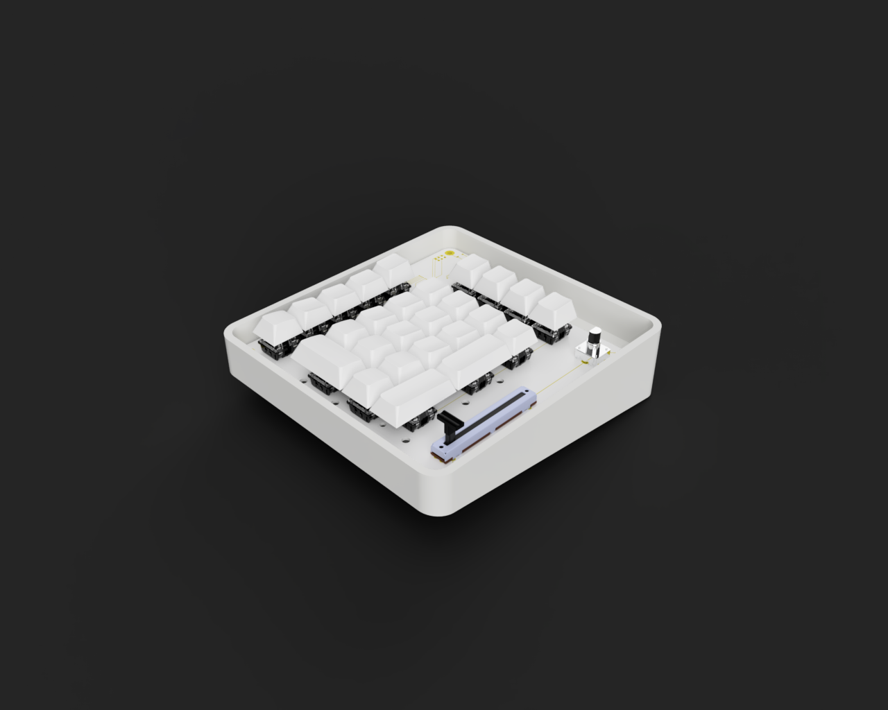

# 🧮 Custom Mechanical Numpad (PCB + Enclosure)

[](LICENSE)


A compact, custom **mechanical numpad** design featuring:
- a **rotary encoder** (knob input),
- a **linear potentiometer** (slider input), and
- a fully custom **KiCad PCB + enclosure workflow**.

This project was built as a personal learning sandbox for keyboard electronics, PCB design, and mechanical packaging—not as a production-ready product.

---

## ✨ Highlights

- ✅ Custom schematic + PCB layout in **KiCad 7**
- ✅ MX-style mechanical switch support
- ✅ Rotary encoder + slider integration
- ✅ 3D enclosure model in **Fusion 360**
- ✅ Included CAD export (`.stp`) for mechanical iteration
- ⚠️ Prototype concept (not manufactured yet)

---

## 📁 Repository Structure

```text
.
├── README.md
├── LICENSE
├── numpad.kicad_sch        # Main schematic
├── numpad.kicad_pcb        # Main PCB layout
├── numpad.kicad_pro        # KiCad project file
├── matrix.kicad_sch        # Matrix / auxiliary schematic
├── fp-lib-table            # KiCad footprint library table
├── sym-lib-table           # KiCad symbol library table
├── cad/
│   └── Numpad.stp          # 3D enclosure/assembly model
└── numpad-backups/         # KiCad backup archives
```

---

## 🧰 Toolchain

- **[KiCad 7](https://www.kicad.org/)** — schematic capture + PCB design
- **[Fusion 360](https://www.autodesk.com/products/fusion-360/)** — enclosure and mechanical modeling
- **[FlatCAM](http://flatcam.org/)** *(optional)* — CAM prep for PCB milling workflows
- **[FreeCAD](https://www.freecad.org/)** *(optional)* — STEP validation/cleanup

---

## 🚀 Getting Started

### 1) Clone the repository

```bash
git clone <your-fork-or-repo-url>
cd numpad_pcb
```

### 2) Open in KiCad

- Open `numpad.kicad_pro` in KiCad 7.
- Review linked symbol/footprint libraries from:
  - `sym-lib-table`
  - `fp-lib-table`

### 3) Explore the board + enclosure

- PCB layout: `numpad.kicad_pcb`
- 3D CAD model: `cad/Numpad.stp`

---

## 🔌 Libraries & Credits

This project references community keyboard/E-CAD assets.

- **MX switch footprints** by [ai03-2725](https://github.com/ai03-2725)
- **USB Type-C footprint** by [philb](https://github.com/philb)
- **Official KiCad symbol/footprint libraries** by the [KiCad project](https://github.com/KiCad)
- **Keyboard footprint resources** from [digistump/random-keyboard-parts.pretty](https://github.com/digistump/random-keyboard-parts.pretty)

If you reuse this design, please retain attribution for upstream libraries and respect their licenses.

---

## 📸 Preview



_Render preview of the custom numpad enclosure + PCB assembly._

---

## 👤 Author

**Siddharth Kumar Ananda Kumar**

- GitHub: [@Steelbot2803](https://github.com/Steelbot2803)
- Portfolio: [sid2028-portfolio.netlify.app](https://sid2028-portfolio.netlify.app/)
- LinkedIn: [linkedin.com/in/sidkak](https://linkedin.com/in/sidkak)

---

## 📜 License

Distributed under the **MIT License**. See [LICENSE](LICENSE) for details.

---

## ⚠️ Disclaimer

This is a prototype and learning project. The design has not been validated for production manufacturing, compliance, or long-term reliability.
